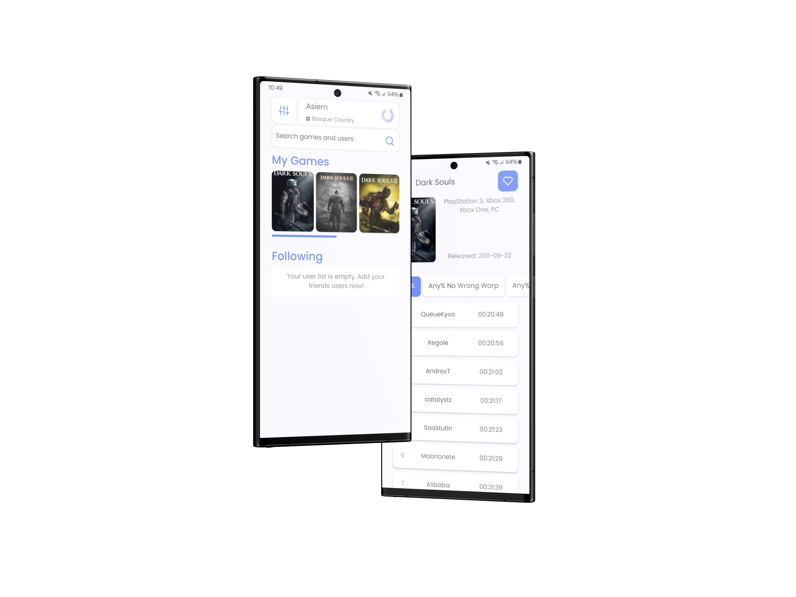

# :trophy:SpeedrunHub

---

`SpeedrunHub` is an open source app for Android made with [React Native](https://reactnative.dev/) and [Expo](https://expo.io/).
It allows you to consult the speedrun.com page natively on your device. All the data is provided by the speedrun.com [REST API](https://github.com/speedruncomorg/api).

**Disclaimer: This is not an official app**

- [Features](#features)
- [Downloads](#Downloads)
- [Contributing](#Contributing)
- [Creating Issues](#creating-issues)
- [Feedback and Issue Reporting](#feedback-and-issue-reporting)
- [Privacy Policy / Terms & Conditions / License](#privacy-policy--terms--conditions--license)

## Features

- Receive all Speedrun.com notifications directly to your phone ([API-Key](https://github.com/speedruncomorg/api/blob/master/authentication.md#aquiring-a-users-api-key) is needed)
- Search for users and watch their PBs
- Search for game leaderboards
- Manage your favorite games
- Follow users
- View game runs

## Downloads

Download the app for your device:
- [Google Play](https://play.google.com/store/apps/details?id=com.asiern.speedrun2)
- [Expo](https://expo.dev/accounts/asiern/projects/speedruncomapp/builds)
- [Github](https://github.com/Asiern/SpeedrunHub/releases/)

## Contributing

If you're interested in contributing to this project, you can get started by reading the development [section](CONTRIBUTING.md) in the README. The development section provides information about the project's dependencies, configuration steps, and how to set up the development environment. It will guide you through the necessary steps to contribute effectively. Feel free to explore the codebase and submit your contributions following the project's guidelines. We appreciate your interest and look forward to your contributions!

## ## Creating Issues

To report a problem, suggest an improvement, or request a new feature, you can create an issue in the project's repository. Follow these steps to create a new issue:

1. Go to the repository on GitHub.
2. Click on the "Issues" tab at the top of the repository's page.
3. Click on the green "New Issue" button.
4. Provide a descriptive title for the issue that summarizes the problem or request concisely.
5. In the issue description, provide detailed information about the issue, including any steps to reproduce the problem, relevant code snippets, or screenshots if applicable.
6. You can use Markdown formatting to make the issue description more readable and organized.
7. Add any relevant labels or assignees to the issue to help categorize and assign it to the appropriate team member.
8. Once you're ready, click on the "Submit new issue" or "Create issue" button to create the issue.

Creating clear and well-documented issues helps in efficient communication and problem resolution within the project.

## Feedback and Issue Reporting

If you come across an issue, have a question, or would like to request a new feature, there are multiple ways to reach out and provide your feedback.

1. **Opening an Issue**: If you find a bug, encounter an error, or have a specific problem with the project, you can open an issue on the project's GitHub repository. To do this, follow the steps outlined earlier in the "Creating Issues" section. Provide detailed information about the issue, steps to reproduce it, and any relevant code or screenshots.
    
2. **Sending an Email**: If you prefer to communicate privately or have a general question, you can also reach out via email. Feel free to send an email to [asiern.dev@gmail.com](mailto:asiern.dev@gmail.com). Include a clear subject line and provide as much detail as possible in your message. I'll be happy to assist you and address any concerns or questions you may have.
    

Remember, opening an issue or sending an email is not limited to reporting issues only. It's also a way to share your thoughts, ask questions, or request new features for the project. Your feedback and input are valuable in shaping the project and making it better.

Whichever method you choose, whether opening an issue on GitHub or sending an email, I appreciate your involvement and look forward to hearing from you. Your feedback helps improve the project and ensures a better experience for all users.

## Privacy Policy / Terms & Conditions / License

- [Privacy Policy](./docs/Privacy%20Policy.md)
- [Terms & Conditions](./docs/Terms%20%26%20Conditions.md)
- [License](LICENSE)
